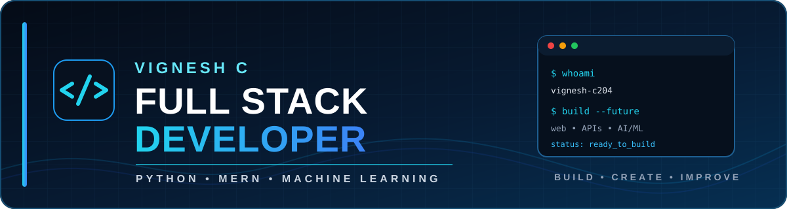

  

  

  

<table>
<tr>
<td width="52%" valign="top">

## 👨‍💻 About Me

Hi, I'm **Vignesh C**, an **MCA graduate and Python / Full Stack Developer** focused on building practical web applications, backend APIs and AI-powered solutions.

- 🐍 Python · Flask · Django · REST APIs
- ⚛️ React · Node.js · Express · MERN
- 🤖 TensorFlow · Keras · LSTM · GRU · Transformers
- 🗄️ MySQL · SQLite · MongoDB
- ⚡ Interested in clean architecture, performance and scalable systems
- 🤝 Experienced with Agile development and Git/GitHub workflows

</td>
<td width="48%" valign="top">

## 🛠️ Skills & Technologies

**Frontend**  
React.js · HTML5 · CSS3 · JavaScript

**Backend**  
Python · Flask · Django · Node.js · Express.js · REST APIs

**Database**  
MySQL · SQLite · MongoDB

**AI / ML**  
TensorFlow · Keras · LSTM · GRU · Transformers · Reinforcement Learning

**Tools**  
Git · GitHub · VS Code

</td>
</tr>
</table>

## 💼 Professional Experience

### Python Developer Intern — Emglitz Technologies
**Jan 2026 – May 2026 · Coimbatore, Tamil Nadu**

- Developed and shipped **5+ features** for the StockVision AI platform using Flask.
- Worked with a **hybrid GRU-Transformer ensemble** for stock-price prediction.
- Optimized API queries and implemented caching, reducing average response time by approximately **30%**.
- Integrated Machine Learning and Reinforcement Learning **Buy / Sell / Hold** models into REST APIs using TensorFlow/Keras.
- Worked with feature selection, hyperparameter tuning and real-time prediction workflows.
- Designed normalized MySQL/SQLite schemas for stock data, predictions and trading decisions.
- Collaborated in a **4-engineer Agile team**.

## 🚀 Featured Project — StockVision

**AI-Powered Stock Market Analysis & Prediction Platform** built with Python and Flask, combining market data, preprocessing and TensorFlow/Keras prediction workflows.

| Component | Technology |
|---|---|
| Backend | Flask + REST APIs |
| Frontend | HTML · CSS · JavaScript |
| ML | TensorFlow · Keras · LSTM · GRU · Transformers |
| Data | yfinance · NumPy · Pandas |
| Database | MySQL · SQLite |
| Performance | Query optimization + response caching |
| Security | Authentication · Sessions · Password hashing |

## 🛒 Other Project — Organic Shop

**Full-Stack MERN E-Commerce Application**

MongoDB · Express.js · React.js · Node.js · REST APIs · JWT · Git

- JWT authentication and role-based access control
- Product catalog, cart, checkout and order management
- Admin analytics and order workflows
- **15+ REST API endpoints** and **30+ test cases**

## 🎓 Education

| Qualification | Institution | Period | Result |
|---|---|---|---|
| **MCA** | Excel Engineering College, Namakkal · Anna University | 2024 – 2026 | **CGPA 7.4** |
| **B.Sc. Computer Science** | Govt. Arts & Science College, Sathyamangalam · Bharathiyar University | 2021 – 2024 | **CGPA 7.0** |

## 📜 Certifications

- **Full Stack Developer** — Refinement Software Solutions Pvt. Ltd.
- **Full Stack Python & Web Development** — Nurture Infotech
- **Complete Node.js Bootcamp** — Udemy
- **Front-End Development** — Udemy

### 💙 BUILD • CODE • LEARN • IMPROVE

**Thanks for visiting my profile! ⭐**

